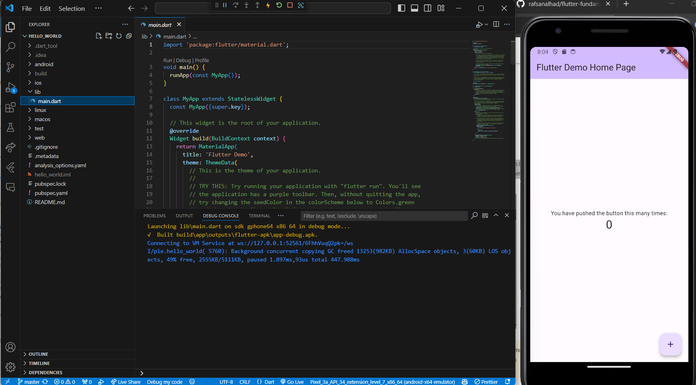
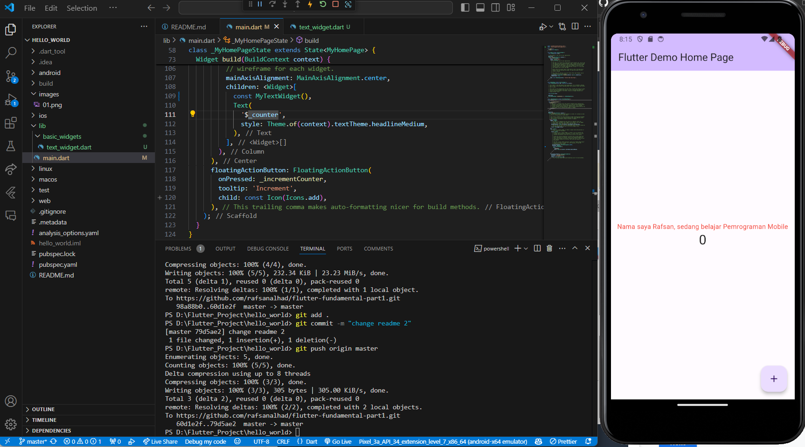
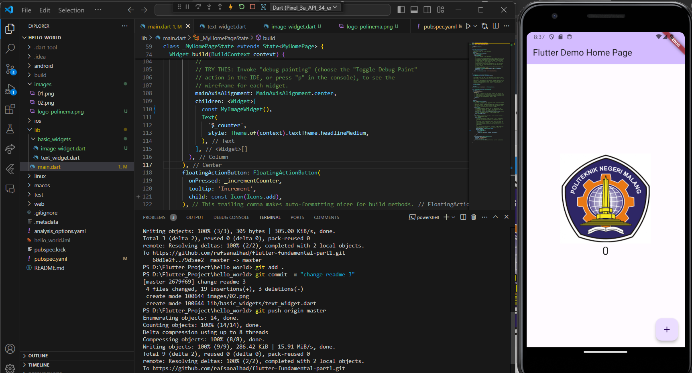
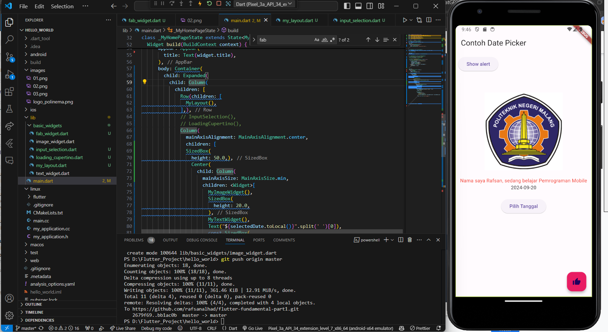

# Muhammad Harafsan Alhad

Muhammad Harafsan Alhad

Lakukan import file text_widget.dart ke main.dart, lalu ganti bagian text widget dengan kode di atas. Maka hasilnya seperti gambar berikut. Screenshot hasil milik Anda, lalu dibuat laporan pada file README.md.

Output Final Paktikum 3

Output Final Praktikum 4

